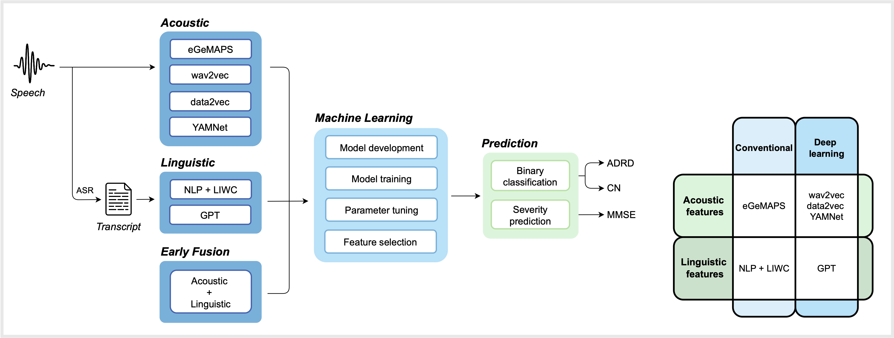

# Predictive Modelling for Early Screening of Cognitive Impairment from Speech

This code is based on the results presented in the arXiv [paper](https://arxiv.org/abs/2501.18731) _Evaluating Spoken Language as a Biomarker for Automated Screening of Cognitive Impairment_. 

## Abstract

More than 75% of dementia cases today are undiagnosed.
Timely and accurate assessment of cognitive impairment is a major unmet need in populations at risk. 
Speech and language changes can be early predictors of Alzheimer’s disease and related dementias (ADRD) before clinical signs of neurodegeneration, offering an opportunity for early detection. 
_**Speech biomarkers**_ provide a scalable, non-invasive solution for automated screening. 
However, ML approaches face barriers to clinical translation fue to limited generalisability, interpretability, and scarcity of clinically representative datasets.

This study introduced an interpretable ML approach for automated assessment of cognitive health from spoken language. 
We evaluated predictive models using a benchmark DementiaBank dataset and pilot data collected in-residence from older adults. 

## ML Pipeline

We explored acoustic, linguistic and six multimodal feature combinations using early fusion methods. 

  
  
<em>Proposed ML pipeline for cognitive health assessment (left) and features extracted (right).</em>

## Analysis Structure

Key notebooks:
- [`classif.ipynb`](./notebooks/classif.ipynb) – ADRD detection.
- [`reg.ipynb`](./notebooks/reg.ipynb) – Mini-Mental State Examination (MMSE) score prediction to assess severity of cognitive decline.
- [`shap_analysis.ipynb`](./notebooks/shap_analysis.ipynb) - Feature importance analysis to identify the linguistic features most predictive of ADRD.
- [`risk_analysis.ipynb`](./notebooks/risk_analysis.ipynb) - Risk stratification. 

Core ML methods are included in [`./src/mlcog`](./src/mlcog).

## Contact

For any clarification or interest in the work contact maria.lima@imperial.ac.uk.
